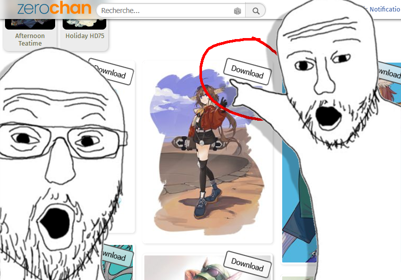
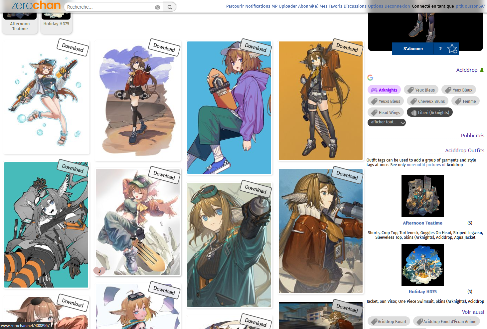
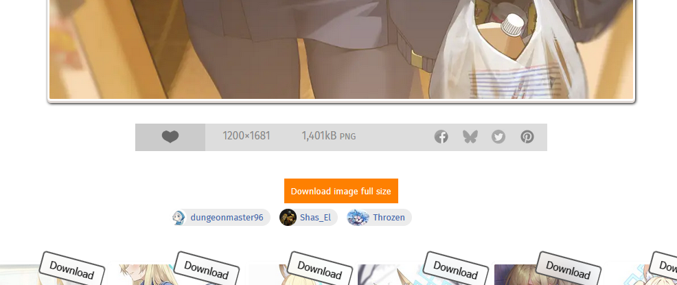
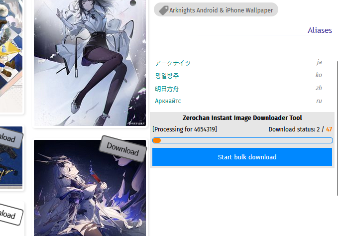
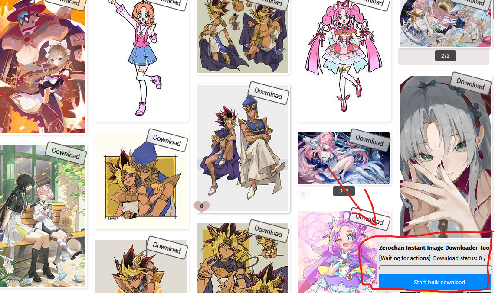

# Zerochan Instant Image Downloader

A userscript that adds instant download buttons to images on Zerochan.net, allowing you to download full-resolution wallpapers directly from the gallery pages. Allow bulk download too.

</i>

## Features

- Adds download buttons to each image thumbnail on Zerochan pages
- Bulk download
- Work on ***PC*** and ***mobile browsers***
- Downloads images in their original full resolution
- No need to navigate to individual image pages
- Added a button to directly download the full-size image in preview mode.
- Displays the version of your script and the latest version available in the footer of the site

## Installation

### Option 1: Using Tampermonkey (Recommended)

1. Install the [Tampermonkey extension](https://www.tampermonkey.net/) for your browser (Chrome, Firefox, Safari, Edge, etc.).
2. Open Tampermonkey and create a new script.
3. Copy and paste the entire contents of `script.js` into the script editor.
4. Save the script.

### Option 2: Manual Injection

1. Navigate to a Zerochan page with wallpapers (e.g., https://www.zerochan.net/).
2. Open your browser's developer console (F12 or right-click > Inspect > Console).
3. Copy and paste the entire contents of `script.js` into the console.
4. Press Enter to execute the script.

### Option 3: Using Greasy Fork

1. Install a userscript manager like [Tampermonkey](https://www.tampermonkey.net/).
2. Visit the script page on [Greasy Fork](https://greasyfork.org/fr/scripts/565142-zerochan-instant-image-downloader) and search for "Zerochan instant image downloader".
3. Click the "Install" button on the script page.

## Usage

1. After installing the script, visit any Zerochan gallery page.
2. You'll see "Download" buttons overlaid on each image thumbnail.
3. Click the button to instantly download the full-resolution image.

## Preview

### Individual download button

### Preview image download button

### Bulk download tool

## Note
The script listens for page loads on Zerochan.net and dynamically adds download buttons to each image thumbnail. When clicked, these buttons fetch the full-resolution image URL and trigger a download without navigating away from the gallery page.

If you are on phone, the code needs to fetch the json again with &screen=1 to get json data because phone mode don't load the json by default. And we try to fetch again with &mobile=1 because Zerochan switch user to pc version if you request the json with screen=1.